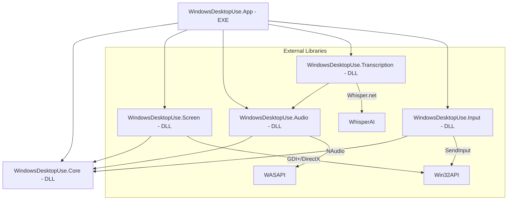

# 開発者ガイド

このドキュメントでは、`windows-desktop-use-mcp` のビルド、テスト、およびアーキテクチャの詳細について説明します。

## アーキテクチャ

本プロジェクトは、保守性と再利用性を高めるため、機能ごとに複数のモジュール（DLL）に分割されています。

### コンポーネント構成図



### モジュール詳細

| プロジェクト名 | 役割 | 主な内容 |
| :--- | :--- | :--- |
| **`WindowsDesktopUse.Core`** | 基盤 | 共通のデータモデル（MonitorInfo, WindowInfo）、インターフェース、例外定義。 |
| **`WindowsDesktopUse.Screen`** | 視覚 | GDI+ および DirectX を使用した画面・ウィンドウキャプチャ、ターゲット列挙。 |
| **`WindowsDesktopUse.Audio`** | 聴覚 (録音) | WASAPI を使用したシステム音およびマイク入力の録音。 |
| **`WindowsDesktopUse.Transcription`** | 聴覚 (解析) | Whisper.net を使用した音声データのテキスト化（文字起こし）。 |
| **`WindowsDesktopUse.Input`** | 手足 (操作) | `SendInput` API を使用した低レベルなマウス・キーボード入力のシミュレーション。 |
| **`WindowsDesktopUse.App`** | ホスト | MCP サーバーとしてのエントリポイント。各モジュールを統合しツールとして公開。 |

---

## ビルド

### 要件
- Windows 11 (または 10 1803+)
- .NET 8.0 SDK

### ビルドコマンド
```powershell
# ソリューション全体のビルド
dotnet build WindowsDesktopUse.sln -c Release

# 実行ファイル (EXE) の場所:
# src/WindowsDesktopUse.App/bin/Release/net8.0-windows/win-x64/WindowsDesktopUse.App.exe
```

---

## 重要: 高DPI環境への対応

本サーバーは `SetProcessDPIAware()` を呼び出しているため、物理ピクセル単位で動作します。
- `Screen` モジュールで取得される座標とサイズは物理ピクセルです。
- `Input` モジュールで指定するマウス座標も物理ピクセルとして解釈されます。
これにより、AI がキャプチャ画像から算出した座標をそのままマウス操作に使用しても、ズレが発生しないよう設計されています。

---

## ログ出力の注意点

MCP の `stdio` トランスポートは `stdout` を JSON-RPC 通信に使用します。
開発時にログを出力する場合は、**必ず `Console.Error.WriteLine` を使用してください**。`stdout` への書き込みはプロトコルを破壊し、クライアント（Claude 等）の切断を招きます。

---

## テスト

### E2E テスト
`tests/E2ETests` には、実際にサーバーを起動してツールを呼び出す結合テストが含まれています。
```powershell
dotnet test tests/E2ETests/E2ETests.csproj
```

### 特定のテストの実行 (例: Notepad操作)
```powershell
dotnet test tests/E2ETests/E2ETests.csproj --filter "FullyQualifiedName~Notepad"
```

---

## トラブルシューティング

| 問題 | 解決策 |
|-------|--------|
| 画面が真っ黒 | 制限されたセッション（ロック画面等）ではキャプチャできません。また、管理者権限での実行が必要な場合があります。 |
| 入力が反映されない | 操作対象のアプリが管理者権限で実行されている場合、本サーバーも管理者権限で実行する必要があります（UIPIの制限）。 |
| Whisper モデルのロード失敗 | `ggml-base.bin` などのモデルファイルが `models/` ディレクトリに存在することを確認してください。 |
