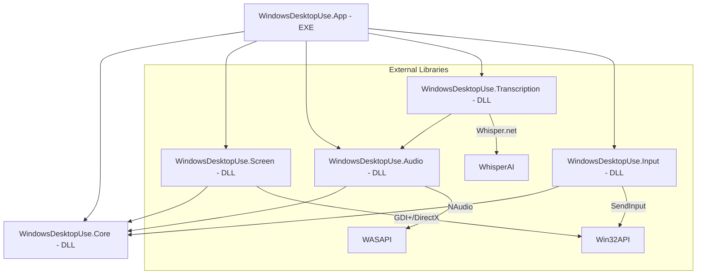

# Development Guide

This document provides details on building, testing, and the architecture of `windows-desktop-use-mcp`.

## Architecture

The project is divided into several modules (DLLs) to enhance maintainability and reusability.

### Component Diagram



### Module Details

| Project Name | Role | Description |
| :--- | :--- | :--- |
| **`WindowsDesktopUse.Core`** | Foundation | Common data models (MonitorInfo, WindowInfo), interfaces, and exception definitions. |
| **`WindowsDesktopUse.Screen`** | Vision | Screen and window capture using GDI+ and DirectX, and target enumeration. |
| **`WindowsDesktopUse.Audio`** | Hearing (Record) | Audio recording from system and microphone using WASAPI (NAudio). |
| **`WindowsDesktopUse.Transcription`** | Hearing (Analyze) | AI transcription using Whisper.net to convert audio to text. |
| **`WindowsDesktopUse.Input`** | Limbs (Control) | Low-level mouse and keyboard input simulation using the `SendInput` Win32 API. |
| **`WindowsDesktopUse.App`** | Host | The entry point for the MCP server. Integrates all modules and exposes tools. |

---

## Building

### Requirements
- Windows 11 (or Windows 10 1803+)
- .NET 8.0 SDK

### Build Commands
```powershell
# Build the entire solution
dotnet build WindowsDesktopUse.sln -c Release

# Executable (EXE) Location:
# src/WindowsDesktopUse.App/bin/Release/net8.0-windows/win-x64/WindowsDesktopUse.exe
```

---

## Important: High DPI Awareness

This server calls `SetProcessDPIAware()` and operates in physical pixel units.
- Coordinates and sizes retrieved by the `Screen` module are in physical pixels.
- Mouse coordinates specified in the `Input` module are interpreted as physical pixels.
This design ensures that coordinates calculated by an AI from capture images match the input coordinates perfectly without any offset.

---

## Logging Precautions

The MCP `stdio` transport uses `stdout` for JSON-RPC communication.
When logging for development, **always use `Console.Error.WriteLine`**. Writing to `stdout` will corrupt the protocol and cause the client (like Claude) to disconnect.

---

## Testing

### E2E Tests
The `tests/E2ETests` directory contains integration tests that launch the server and call its tools.
```powershell
dotnet test tests/E2ETests/E2ETests.csproj
```

### Running Specific Tests (e.g., Notepad interaction)
```powershell
dotnet test tests/E2ETests/E2ETests.csproj --filter "FullyQualifiedName~Notepad"
```

---

## Troubleshooting

| Issue | Solution |
|-------|----------|
| Black screen | Capture is not possible in restricted sessions (e.g., lock screen). Running as Administrator may be required. |
| Input not working | If the target application is running as Administrator, this server must also be run as Administrator (UIPI restriction). |
| Whisper model fails to load | Ensure model files like `ggml-base.bin` are present in the `models/` directory. |